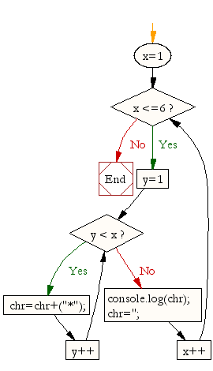

### Looping a Pattern

Write a JavaScript program to construct the following pattern, using a nested for loop.

```
*  
* *  
* * *  
* * * *  
* * * * *
```
HINT: You will need to nest a for loop inside of a for loop.

Here is a flowchart to help you:

